# CH0X0用户手册
<p style="text-align: right;">IMU/VRU/AHRS姿态测量模块, Rev 1.0
<p style="text-align: right;"> 适用于 CH010(M)/CH020(M)/CH040(MP)


<div align="center">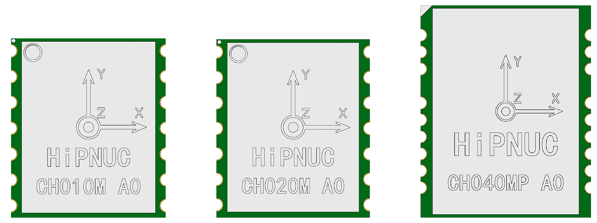


<div style="width:100%">
    <div style="float:left;width 50%" >	文件：CH0X0_UM_CN <br><br>     
    									属性：公开</div>  
	<div style="float:right;width 50%">	技术支持：support@hipnuc.com<br><br>
					                	网站：www.hipnuc.com<br></div> 		
</div> 	


<div ></div>


© 2016-2022, 北京超核电子科技有限公司版权所有，本文档所包含的信息在没有通知的情况下可能会发生更改。

<div STYLE="page-break-after: always;"></div>
文档变更历史

| 版本 | 日期          | 作者   | 变更内容 |
| ---- | ------------- | ------ | -------- |
| V1.0 | 2022年6月18日 | HiPNUC | 初始版本 |

<div STYLE="page-break-after: always;"></div>


[TOC]

<div STYLE="page-break-after: always;"></div>

## 产品简介

​		CH0X0系列是利用高性能、小体积MEMS惯性器件感知物体姿态信息的姿态感知系统，它集成了惯性测量单元、磁力计、气压计和一款搭载扩展卡尔曼融合算法（EKF）的微控制器。可输出经过传感器融合算法计算得到的基于当地地理坐标的三维方位数据，包含有绝对参考的航向角，俯仰角和横滚角。同时也可以输出校准过的原始的传感器数据。表贴式的封装可以很方便的集成到用户的系统，CH0X0系列主要包含CH010(M)，CH020(M)，CH040(MP)三个系列产品:

<table >
    <tr align="center">
        <th >型号</th>
        <th>CH010</th>
        <th>CH010M</th>
        <th>CH020</th>
         <th>CH020M</th>
         <th>CH040</th>
         <th>CH040MP</th>
    </tr>
    <tr align="center">
        <td>级别</td>
        <td colspan = "2">消费级</td>
        <td colspan = "2">工业级</td>
        <td colspan = "2">工业级</td> 
    </tr>
     <tr align="center">
        <td>IMU阵列</td>
        <td colspan = "2">1</td>
        <td colspan = "2">2</td>
        <td colspan = "2">4</td> 
    </tr>
      <tr align="center">
        <td>地磁</td>
        <td >-</td>
        <td >●</td>
        <td >-</td>
        <td >●</td>
        <td >-</td>
         <td >●</td>
    </tr>
      <tr align="center">
        <td>气压</td>
        <td >-</td>
        <td >-</td>
        <td >-</td>
        <td >-</td>
        <td >-</td>
        <td >●</td>
    </tr>
</table>
### 算法架构		

​		CH0X0采用超核最新的融合算法引擎，该算法引擎采用了自主研发的扩展卡尔曼滤波和IMU噪声动态分析技术，可以满足高动态下姿态角的精度，并且减小航向角的漂移。算法架构如下图

<div align="center">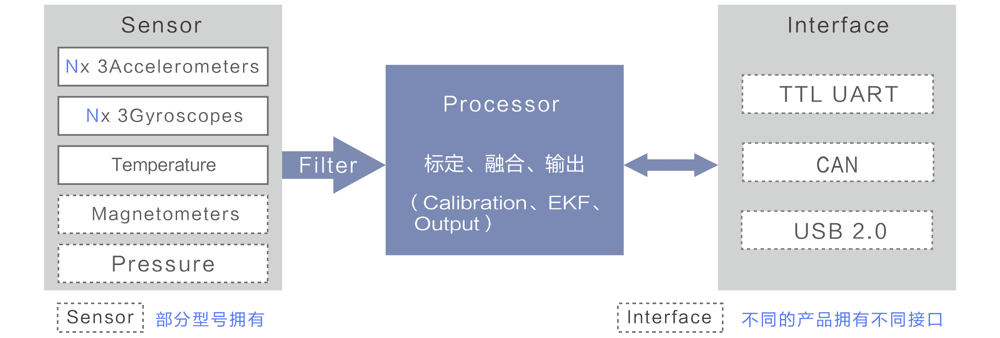

### 主要应用场景:

​		CH0X0系列可以精确地感知移动设备的俯仰（Pitch）、横滚（Roll）、航向（Yaw）等姿态信息，比如AR/VR，自动导引小车（AGV），巡检机器人、无人机等应用领域。它可与激光雷达（Lidar）、视觉（Camera）等导航方案形成优势互补，增强设备的导航精度，并减小对外界参考物体的依赖。典型的应用市场如下：

- 自动导引小车（AGV/AMR）

- 服务机器人

- 巡检机器人

- 组合导航（INS）

- 工程机械

- 智慧农机

- 倾角检测

  

### 产品特点

#### 出厂标定

​		MEMS惯性传感器由于制造工艺、材质等问题，有一些共性的误差源，比如零偏（Bias）、比例因子（Scale Factor）、跨轴（Cross Axis），这些误差会在出厂之前会经过严格的标定程序，减少这些误差的影响，标定参数会保存在每一个产品中。

#### 可输出多种数据类型

​		CH0X0拥有数据预处理和基于四元数的扩展卡尔曼（EKF）数据融合引擎，因此可以为用户提供原始数据，姿态数据、四元数、温度等数据信息。详细介绍如下

- 加速度（Accleration）含有重力并标定后的加速度
- 角速度（Angular Rates） 标定后的角速度
- 姿态角（Attitude） 俯仰（Pitch）、航滚（Roll）、航向（Yaw）
- 四元数（Quaternion） 姿态四元数
- 温度（Temprature）传感器内部温度

#### 数据接口

​		为更好地满足CH0X0系列在各种场景下的应用，CH0X0系列串口波特率范围为9600-921600bps（UART TTL），同时CH0X0 还提供CAN2.0接口，其中串口最高帧率可以达到400Hz，CAN2.0最高帧率200Hz。并且提供完善的Linux、ROS1/ROS2、Win、MCU驱动。

> 注：CH0X0 系列CAN遵循CANopen协议和SAE J1939协议，如果使用CAN接口，还需要外接CAN总线收发器。

#### 其他

* 制造优势： 选用高性能惯性传感器，并且采用自动化批量标定与测试，保证产品一致性。
* 软件优势： 丰富的行业经验，融合先进的算法，可以在静止检测、慢速检测、快速启动，实时估算零偏、地磁自动校准、抗磁场干扰等方面，具有优势表现。

### 辅助开发套件

#### CH0X0系列评估套件CH0X0DK_USB

- 板载USB-Serial converter(CP2102N) 
- 集成CH0X0系列模组             
- 2.54排针数据接口
- 静电防护 IEC61000-4-2 ESD ±15KV 
>CH0X0DK_USB方便用户快速评估CH0X0系列模组各种特性，详细说明参考CH0X0DK_USB用户手册，或者新手指南

<div STYLE="page-break-after: always;"></div>

<div align="center">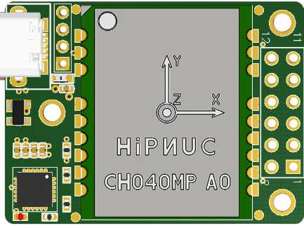

#### 上位机软件CHCenter

​		CHCenter是我们为了用户快速评估产品而开发的一款PC端软件，可以自由的运行在WIN/Linux之上。CHCenter具有如下特点：

- 数据显示
- 数据记录
- 数据分析
- 产品参数配置
-  固件升级

<div align="center">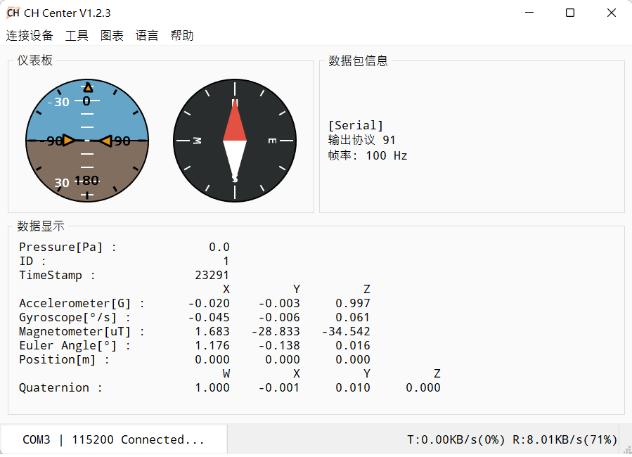


### 订购信息

|    料号    |  型号   | 规格描述                                     |  级别  | 环保标准 |
| :--------: | :-----: | -------------------------------------------- | :----: | :------: |
| AM01-11001 |  CH010  | 6轴姿态传感器 IMU/VRU 表贴封装               | 消费级 |   RoHS   |
| AM01-11002 | CH010M  | 9轴姿态传感器IMU/VRU/AHRS 表贴封装           | 消费级 |   RoHS   |
| AM03-13001 |  CH020  | 6轴阵列姿态传感器 IMU/VRU 表贴封装           | 工业级 |   RoHS   |
| AM03-13002 | CH020M  | 9轴阵列姿态传感器IMU/VRU/AHRS 表贴封装       | 工业级 |   RoHS   |
| AM03-13005 |  CH040  | 6轴阵列姿态传感器 IMU/VRU 表贴封装           | 工业级 |   RoHS   |
| AM03-13006 | CH040MP | 9轴阵列姿态传感器IMU/VRU/AHRS 带气压表贴封装 | 工业级 |   RoHS   |

<div STYLE="page-break-after: always;"></div>

## 机械与电气特性

### CH010/CH020尺寸图

所有标注单位均为mm

<div align="center">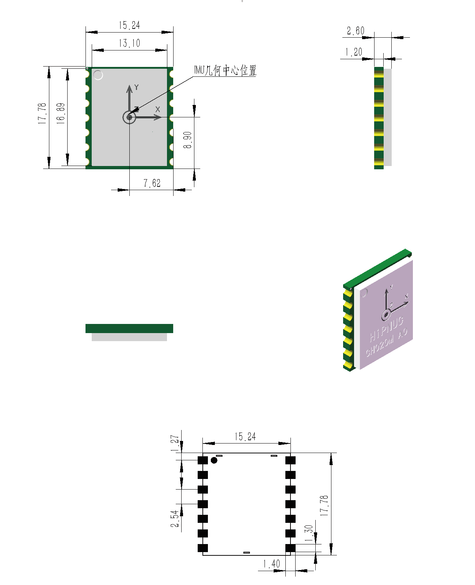

>由于产品背部有测试焊盘，用户需要严格按照推荐尺寸来设计产品封装。
<div STYLE="page-break-after: always;"></div>

### CH010/CH020系列引脚分配


<div align="center">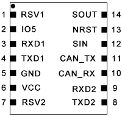

| 引脚 | 名称     | 类型 | 描述                                                         |
| :--- | :------- | :--- | :----------------------------------------------------------- |
| 1    | RSV1     | N/A  | 留作将来使用，当前必须悬空                                   |
| 2    | IO5      | I/O  | 留作将来使用，当前必须悬空                                   |
| 3    | RXD1     | I    | 模块串口接收 UART RXD(接主机的发送)                          |
| 4    | TXD1     | O    | 模块串口发送 UART TXD (接主机的接收)                         |
| 5    | GND      | 电源 | GND                                                          |
| 6    | VCC      | 电源 | 电源输入                                                     |
| 7    | RSV2     | N/A  | 保留，必须悬空                                               |
| 8    | TXD2     | O    | 保留，必须悬空                                               |
| 9    | RXD2     | I    | 保留，必须悬空                                               |
| 10   | CAN_RX   | I    | CAN_RX                                                       |
| 11   | CAN_TX   | O    | CAN_TX                                                       |
| 12   | SYNC_IN  | I    | 数据同步输入: 内部上拉，当模块检测到下降沿时, 会输出一帧数据。不使用时需悬空 |
| 13   | NRST     | I    | 复位, 内部上拉。>10uS  低电平复位模块。无需外接阻容，建议连接主机的GPIO，也<br/>可悬空 |
| 14   | SYNC_OUT | O    | 数据同步输出, 内部上拉，无数据输出时为高电平 (空闲)，一帧数据开始发送时变为<br/>低电平，一帧数据发送完成后，返回高电平(空闲)。不使用时需悬空 |

<div STYLE="page-break-after: always;"></div>

### CH040系列尺寸图

所有标注单位均为mm 

<div align="center">

> 由于产品背部有测试焊盘，用户需要严格按照推荐尺寸来设计产品封装。
>

<div STYLE="page-break-after: always;"></div>

### CH040系列引脚分配


<div align="center">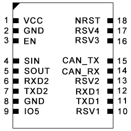

| 引脚 | 名称     | 类型 | 描述                                                         |
| ---- | :------- | :--- | :----------------------------------------------------------- |
| 1    | VCC      | 电源 | 电源输入                                                     |
| 2    | GND      | 电源 | GND                                                          |
| 3    | EN       | I    | 模块使能引脚，高电平有效、默认内部上拉                       |
| 4    | SYNC_OUT | O    | 数据同步输出,  内部上拉，无数据输出时为高电平 (空闲)，一帧数据开始发送时<br>变为低电平，一帧数  据发送完成后，返回高电平(空闲)。不使用时需悬空 |
| 5    | SYNC_IN  | I    | 数据同步输入:  内部上拉，当模块检测到下降沿时, 会输出一帧数据。不使用时需悬空 |
| 6    | RXD2     | I    | 保留，必须悬空                                               |
| 7    | TXD2     | O    | 保留，必须悬空                                               |
| 8    | GND      | 电源 | GND                                                          |
| 9    | IO5      | I/O  | 保留，必须悬空                                               |
| 10   | RSV1     | N/A  | 保留，必须悬空                                               |
| 11   | TXD1     | O    | 模块串口发送  UART TXD (接主机的接收)                        |
| 12   | RXD1     | I    | 模块串口接收  UART RXD(接主机的发送)                         |
| 13   | RSV2     | N/A  | 保留，必须悬空                                               |
| 14   | CAN_RX   | I    | CAN_RX                                                       |
| 15   | CAN_TX   | O    | CAN_TX                                                       |
| 16   | RSV3     | N/A  | 保留，必须悬空                                               |
| 17   | RSV4     | N/A  | 保留，必须悬空                                               |
| 18   | NRST     | I    | 复位, 内部上拉。>10uS 低电平复位模块。无需外接阻容，建议连接主机的<br/>GPIO，也可悬空 |


###  电气与机械参数

<table>
    <tr align="center">
        <th >类型</th>
        <th>条件</th>
        <th>最小值</th>
        <th>典型值</th>
        <th>最大值</th>
        <th>单位</th>
    </tr>
    <tr align="center">
        <td>电源输入VCC</td>
        <td>-</td>
        <td>3.2</td>
        <td>3.3/5</td> 
        <td>7</td> 
        <td>V</td> 
    </tr>
     <tr align="center">
        <td>使能输入EN电压</td>
        <td>-</td>
        <td>-0.3</td>
        <td>-</td>
        <td>VCC</td> 
        <td>V</td> 
    </tr>
     <tr align="center">
          <td>EN阈值<i>V</i><sub><i>IH</i></sub></td>
        <td rowspan = "2">VCC=5V</td>
        <td >2.3</td>
        <td >-</td>
        <td >VCC</td>
        <td >V</td>
    </tr>
     <tr align="center">
        <td>EN阈值<i>V</i><sub><i>IL</i></sub></td>
        <td >-</td>
        <td >-</td>
        <td >0.6</td>
        <td >V</td>
    </tr>
     <tr align="center">
        <td>EN阈值<i>V</i><sub><i>IH</i></sub></td>
        <td rowspan = "2">VCC=3.3V</td>
        <td >1.7</td>
        <td >-</td>
        <td >VCC</td>
        <td >V</td>
       </tr>
    <tr align="center">
        <td>EN阈值<i>V</i><sub><i>IL</i></sub></td>
        <td >-</td>
        <td >-</td>
        <td >0.6</td>
        <td >V</td>
       </tr>
    <tr align="center">
        <td>EN电流<i>I</i><sub><i>EN</i></sub></td>
        <td>-</td>
        <td>-</td>
        <td>0.01</td>
        <td>1</td>
        <td>uA</td>
       </tr>
     <tr align="center">
        <td rowspan = "3">功耗<i>P</i></td>
        <td>CH010(M)</td>
        <td>-</td>
        <td>-</td>
        <td>152</td>
        <td>mW</td>
       </tr>
    <tr align="center">
        <td>CH020(M)</td>
        <td>-</td>
        <td>-</td>
        <td>204</td>
        <td>mW</td>
       </tr>
       <tr align="center">
        <td>CH040(MP)</td>
        <td>-</td>
        <td>-</td>
        <td>242</td>
        <td>mW</td>
       </tr>
          <tr align="center">
        <td>IO电平阈值<i>V</i><sub><i>IH</i></sub></td>
        <td>-</td>
        <td>1.7</td>
        <td>-</td>
        <td>5</td>
        <td>V</td>
       </tr>
      <tr align="center">
        <td>IO电平阈值<i>V</i><sub><i>IL</i></sub></td>
        <td>-</td>
        <td>-</td>
        <td>-</td>
        <td>0.6</td>
        <td>V</td>
       </tr>
      <tr align="center">
        <td>IO电流<i>V</i><sub><i>IO</i></sub></td>
        <td>-</td>
        <td>-20</td>
        <td>-</td>
        <td>20</td>
        <td>mA</td>
       </tr>
    <tr align="center">
     		<td>ESD</td>
          	<td colspan = "5">HBM 2KV，CDM 1KV</td>
       </tr>
      <tr align="center">
     		<td>工作储温度</td>
          	<td colspan = "5">-40℃-85℃</td>
       </tr>
     <tr align="center">
       	 	<td>存储温度</td>
          	<td colspan = "5">-40℃-85℃</td>
       </tr>
     <tr align="center">
        	<td>冲击</td>
          	<td colspan = "5">±2000g</td>
      </tr>
      <tr align="center">
        	<td>MTBF</td>
          	<td colspan = "5">50000h</td>
      </tr>
</table>

> 严禁在使用过程中超过上述限制范围


### 坐标系定义

载体系使用 右-前-上(RFU)坐标系， 地理坐标系使用 东-北-天(ENU)坐标系。加速度和陀螺仪轴向如下图所示。

<div align="center">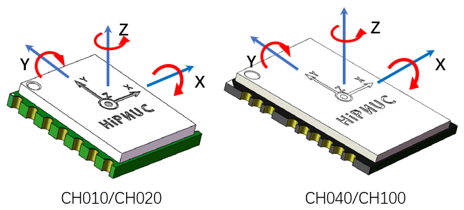

欧拉角旋转顺序为东-北-天-312(先转Z轴，再转X轴，最后转Y轴)旋转顺序。具体定义如下：

- 绕 Z 轴方向旋转: 航向角\Yaw\psi($\psi$) 范围: -180° - 180°
- 绕 X 轴方向旋转:俯仰角\Pitch\theta($\theta$) 范围: -90°-90°
- 绕 Y 轴方向旋转: 横滚角\Roll\phi(  $\phi$)范围: -180°-180°

如果将模块视为飞行器的话。Y轴正方向应视为机头方向。当传感器系与惯性系重合时，欧拉角的理想输出为:Pitch = 0°, Roll = 0°, Yaw = 0°


## 性能指标

### 姿态角输出精度

​		为了提升模块的精度与稳定性，我们将CH0X0系列传感器系统科学地排布在PCB上，并且搭载新一代EKF算法，使得模块性能得以充分发挥。

| 型号                 | CH010 | CH010M | CH020 | CH020M | CH040 | CH040MP |
| :------------------- | :---: | :----: | :---: | :----: | :---: | :-----: |
| Pitch/Roll(static)   | 0.5°  |  0.5°  | 0.3°  |  0.3°  | 0.3°  |  0.3°   |
| Pitch/Roll(dynamic)  | 0.8°  |  0.8°  | 0.5°  |  0.5°  | 0.3°  |  0.3°   |
| Yaw(VRU)(static)^①^  |  1°   |   1°   | 0.5°  |  0.5°  | 0.5°  |  0.5°   |
| Yaw(VRU)(dynamic)^②^ |  10°  |  10°   |  5°   |   5°   |  3°   |   3°    |
| Yaw(magnetic)^③^     |   -   |   2°   |   -   |   2°   |   -   |   2°    |
| Yaw(VRU)^④^          | 0.5°  |  0.5°  | 0.3°  |  0.3°  | 0.3°  |  0.3°   |
| 气压计（高度）       |   -   |   -    |   -   |   -    |   -   |  ±50cm  |

①模块在25℃绝对静止1h测得    
②模块在机器人上运动1h测得，室温25℃ ，1$\sigma$
③地磁校准之后，周边无磁场干扰情况下室温25℃测得，CH010M、CH020M、CH040MP需要配置为9轴模式 
④转台转10圈取每圈平均值，室温25℃ 

### 陀螺仪

| 参数          | 值(CH010)          | 值(CH020)          | 值(CH040)     | 备注           |
| ------------- | ------------------- | -------------- | -------------- | -------------- |
| 测量范围      | ±2000°/s     | ±2000°/s  | ±2000°/s         |  |
| 分频率 | 0.01°/s | 0.01°/s | 0.01°/s | |
| 零偏稳定性 | 5.0°/hr | 3.57°/hr | 2.5°/hr | @25°C,1$\sigma$ |
| 零偏重复性 | 0.09°/s | 0.07°/s | 0.05°/s | @25°C,1$\sigma$ |
| 非正交误差 | ±0.1% | ±0.1% | ±0.1% | @25°C,1$\sigma$ |
| 随机游走 | 0.6$°/\sqrt{hr}$ | 0.42$°/\sqrt{hr}$ | 0.3$°/\sqrt{hr}$ | @25°C,1$\sigma$ |
| 刻度非线性度  | ±0.1% | ±0.1% | ±0.1%     | 满量程时(最大) |
| 刻度系数误差 | 1400ppm | 800ppm | 550ppm | 出厂前校准后 |
| 加速度敏感性  | 0.1°/s/g  | 0.1°/s/g  | 0.1°/s/g          |                |
| Z轴全温零偏变化 | 0.001°/s/℃ | 0.001°/s/℃        | 0.001°/s/℃       | |


陀螺Allan方差曲线(CH010)

<div align="center">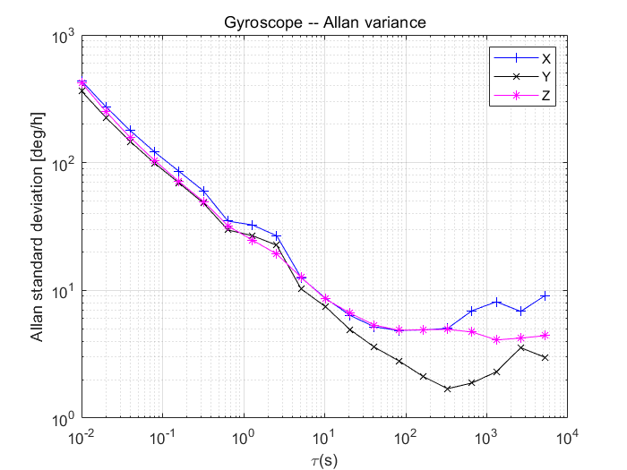

陀螺Allan方差曲线(CH020)

<div align="center">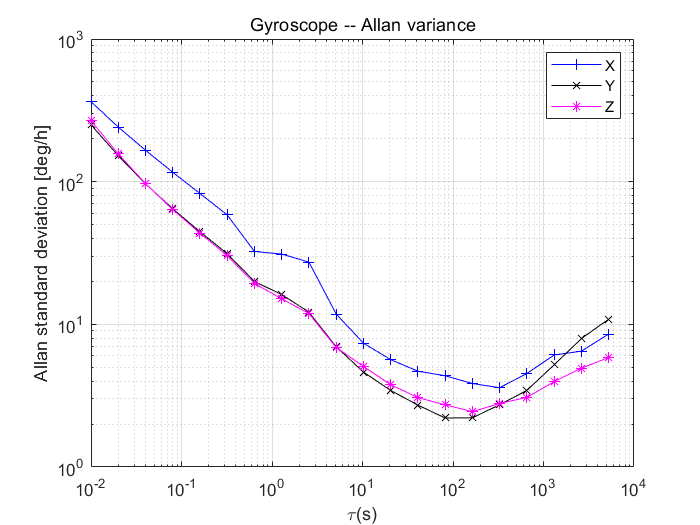

<div STYLE="page-break-after: always;"></div>

陀螺Allan方差曲线(CH040)

<div align="center">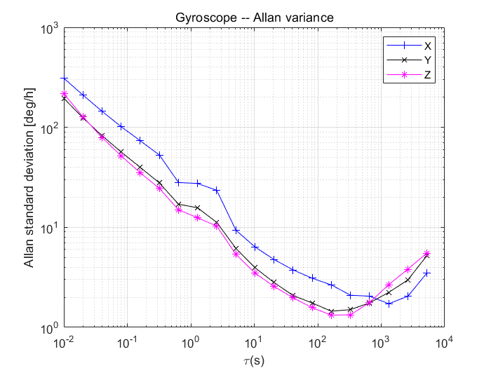

### 加速度计

| 参数             | 值(CH010)         | 值(CH020)         | 值(CH040/)        | 备注                   |
| ---------------- | ----------------- | ----------------- | ----------------- | ---------------------- |
| 测量范围         | ±8G               | ±8G               | ±8G               | 1G = 1x 重力加速度     |
| 分辨率           | 1uG               | 1uG               | 1uG               |                        |
| 零偏稳定性       | 60uG              | 42.43uG           | 30uG              | @25°C,1$\sigma$        |
| 零偏重复性       | 1.8mG             | 1.5mG             | 1.2mG             | @25°C,1$\sigma$        |
| 非正交误差       | ±0.1%             | ±0.1%             | ±0.1%             | @25°C,1$\sigma$        |
| 随机游走         | 0.08$m/s\sqrt{h}$ | 0.06$m/s\sqrt{h}$ | 0.04$m/s\sqrt{h}$ | @25°C,1$\sigma$        |
| 刻度系数误差     | ±1%               | ±0.3%             | ±0.3%             | 出厂前校准后，满量程时 |
| 全温范围温度变化 | ±0.45mg/°C        | ±0.45mg/°C        | ±0.45mg/°C        | -40  - 85°             |

<div STYLE="page-break-after: always;"></div>

加速度Allan方差曲线(CH010)

<div align="center">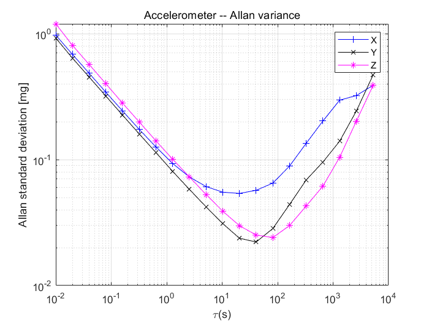

加速度Allan方差曲线(CH020)

<div align="center">

<div STYLE="page-break-after: always;"></div>

加速度Allan方差曲线(CH040)

<div align="center">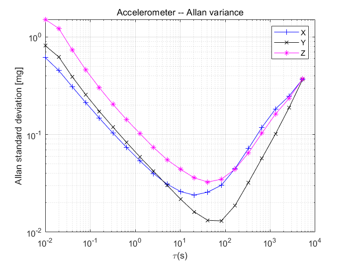


### 磁传感器参数

| 参数     | 值         |
| -------- | ---------- |
| 测量范围 | ±8G(Gauss) |
| 非线性度 | ±0.1%      |
| 分辨率   | 0.25mG     |

### 气压计参数

| 参数         | 值                     |
| ------------ | :--------------------- |
| 测量范围     | 300 – 1200 hPa         |
| 分辨率       | ± 0.006 hPa (or ±5 cm) |
| 精度         | ± 0.06 hPa (or ±50 cm) |
| 内部采样频率 | 64Hz                   |


### 关键参数总结

<table align="center">
    <tr align="center">
        <th>指标</th>
        <th>CH010系列</th>
        <th>CH020系列</th>
        <th>CH040系列</th>
    </tr>
    <tr align="left">
        <td>机械特性</td>
        <td colspan = "3"></td> 
    </tr>
     <tr align="center">
        <td>尺寸</td>
        <td>17.78X15.24X3mm</td>
        <td>17.78X15.24X3mm</td>
        <td>25X20X3mm</td>
    </tr>
     <tr align="center">
        <td>重量</td>
        <td>1.5g</td>
        <td>1.55g</td>
        <td>2.4g</td>
    </tr>
     <tr align="left">
        <td>电气</td>
        <td colspan = "3"></td> 
    </tr>
     <tr align="center">
        <td>电压</td>
        <td colspan = "3">3.2V-7V</td>
    </tr>
     <tr align="center">
        <td>功耗</td>
        <td>152mW</td>
        <td>204mW</td>
        <td>242mW</td>
       </tr>
      <tr align="center">
        <td>启动时间</td>
       <td colspan = "3"><1s</td> 
       </tr>
    <tr align="center">
        <td>启动方式</td>
       <td colspan = "3">静止启动</td> 
       </tr>
      <tr align="left">
        <td>接口-串口</td>
        <td colspan = "3"></td> 
    </tr>
     <tr align="center">
        <td>串口波特率</td>
        <td colspan = "3">9600/115200/230400/460800/921600bps(默认115200)</td>
       </tr>
     <tr align="center">
        <td>数据协议</td>
        <td colspan = "3">超核专有91协议</td>
       </tr>
     <tr align="center">
        <td>模块输出帧率</td>
        <td colspan = "3">1/50/100/200/400Hz(默认100Hz)</td>
       </tr>
     <tr align="center">
        <td>传感器最大输出帧率</td>
        <td colspan = "3">	400Hz原始数据(加速度,角速度)<br>
							400Hz 姿态角<br>
							100Hz磁场原始数据<br>
							64Hz气压计数据<br>
         </td>
       </tr>
        <tr align="left">
        <td>接口-CAN2.0</td>
        <td colspan = "3"></td> 
    </tr>
    <tr align="center">
        <td>波特率</td>
        <td colspan = "3">125K/250K/500K/1000K(默认500K)</td>
       </tr>
     <tr align="center">
        <td>协议</td>
        <td colspan = "3">CANopen/SAE J1939</td>
       </tr>
    <tr align="left">
        <td>环境参数</td>
        <td colspan = "3"></td> 
    </tr>
    <tr align="center">
     		<td>ESD</td>
          	<td colspan = "3">HBM 2KV，CDM 1KV</td>
       </tr>
      <tr align="center">
     		<td>工作储温度</td>
          	<td colspan = "3">-40℃-85℃</td>
       </tr>
     <tr align="center">
       	 	<td>存储温度</td>
          	<td colspan = "3">-40℃-85℃</td>
       </tr>
     <tr align="center">
        	<td>冲击</td>
          	<td colspan = "3">±2000g</td>
      </tr>
     <tr align="center">
        	<td>振动</td>
          	<td colspan = "3">1mm（0-100Hz）&<18g(100Hz-2kHz)</td>
      </tr>
      <tr align="center">
        	<td>MTBF</td>
          	<td colspan = "3">50000h</td>
      </tr>
</table>

<div STYLE="page-break-after: always;"></div>

## 标定

### 出厂标定

​		加速度计和陀螺仪出厂前会经过标定，这些被标定的误差包括比例因子、零偏、非正交误差以及温度。校准参数会被写在模块内部。

### 启动标定

​		为了模组获得更好的性能，我们还为用户提供了上电自动标定的功能，这需要用户在上电的过程中保持水平静止1s，这样可以获得更准确的零偏参数。我们独有的启动算法可以模组很好的避免上电零偏计算错误，充分发挥模块性能。

### 磁力计校准

​		地磁传感器出厂前经过椭球校准，但磁传感器很容易受到外界环境磁场干扰，一般都需要客户在拿到产品后重新校准。
​		模块内部自带主动地磁校准系统，该系统不需要用户发送任何指令，该系统在后台自动采集一段时间内地磁场数据，并做分析比较，剔除异常数据，一旦数据足够，就会尝试地磁校准。所以，当使用9轴模式时，不需要用户任何干预即可完成地磁校准。但是模块仍然提供接口来让用户检查当前校准状态。自动校准的前提是需要模块有充分的姿态变化，并且维持一定时间，内部校准系统才能搜集不同姿态下的地磁场信息，从而完成校准，静止状态下是无法进行地磁校准的。

​		当首次使用模块并且需要使用9轴模式时，应进行如下校准操作：

1. 检查周围是否存在磁场干扰：室内桌子旁，大型铁质框架结构附近，都属于常见的干扰区域。建议将模块拿到室外空旷处，即使没有条件拿到室外，尽量将模块远离(>0.5m)实验室桌子、电脑、电机、手机等容易产生地磁干扰的物体。
2. 在尽量小范围内(位置不动，只是旋转)，缓慢的让模块旋转，让模块经历尽量多的姿态位置(每个轴至少都旋转360°，持续约1分钟)。一般情况下即可完成校准。
3. 虽然地磁参数估计可以在线自动采集数据，自动的动态拟合地磁校准参数。但是如果周围地磁环境改变(比如需要到另外房间或者室内室外切换，或者是模块被安装/焊接到了新的环境中)，还需重复执行1-3步。
6. 如果客户安装位置改变(比如上一次校准是拿着模块单独去校准的，使用的时候却是安装在目标设备上,如和机器人，飞行器)。则需要带着目标设备进行重新校准, 大部分情况，目标设备比较大(大型机器人，甚至汽车)，则此种应用环境中地磁校准不可能做得很好，9轴效果会大打折扣。

#### 磁干扰分类

​		地磁干扰可分为空间磁场干扰与传感器坐标系下的磁场干扰，如下图所示

<div align="center">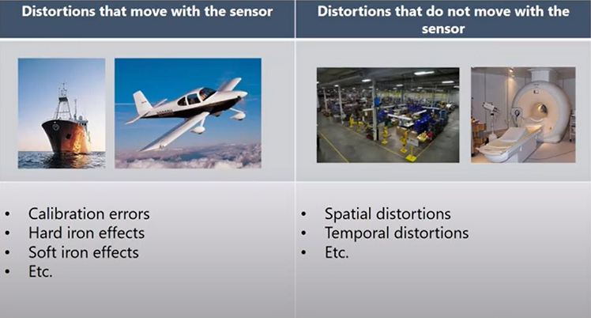

##### 空间磁场干扰(干扰不随传感器位姿改变而改变)

定义：磁场干扰不随传感器运动而运动，处于世界坐标系下
典型干扰源：各种固定的地磁干扰源，家具，家用电器，线缆，房屋内的钢筋结构等。一切不随磁传感器运动而运动的干扰源，下图是典型的室内磁场分布图。

<div align="center">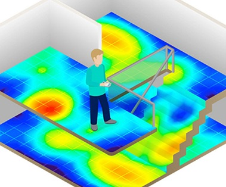

对模块的影响：无论磁场传感器是否校准的好，这些空间磁场的干扰(或者说环境磁场不均匀)都会使得空间地磁场发生畸变。地磁补偿会错误，无法获得正确的航向角。他们是造成室内地磁融合难以使用的主要原因。这种干扰不能被校准, 会严重影响地磁性能。空间磁场干扰在室内尤其严重。
应对措施：只能尽量避免这种干扰源

##### 传感器坐标系下的干扰(干扰随传感器位姿改变而改变)

定义：地磁场干扰源随传感器运动而运动
典型干扰源：与模块固定在一起的PCB板子，仪器设备，产品等。他们和磁传感器视为同一个刚体，随磁传感器运动而运动。
对模块的影响：对传感器造成硬磁/软磁干扰。这些干扰可以通过地磁校准算法加以很好的消除。
应对措施：对模块进行地磁校准。

#### 地磁使用注意事项

在室内环境下，空间磁场干扰尤其严重，而且空间磁干扰并不能通过校准来消除。在室内环境下尽管模块内置均质磁场检测及屏蔽机制，但9轴模式航向角的准确度很大程度上取决于室内磁场畸变程度，如果室内磁场环境很差(如电脑机房旁，电磁实验室，车间，地下车库等)，即使校准后9轴的航向角精度可能还不如6轴模式甚至会出现大角度误差。

模块的自动地磁校准系统只能处理和模块安装在一起的，固定的磁场干扰。安装环境如果有磁场干扰，这种干扰必须是固定的，并且这个干扰磁场与模块 安装之后不会再发生距离变化(例：模块安装在一个铁材料之上，因为铁会有磁场干扰，这时就需要把铁与模块一起旋转校准，并且这个铁在使用当中是不会和罗盘再分开的(发生相对位移)，一旦分开是需要再重新校准。如果这个铁大小是不固定的，或与罗盘的距离变化也不是固定的，这种干扰是无法校准的，即使校准成功，也会精度非常差，只能避而远之安装，安全距离控制在 50cm以上)。

#### 案例分析

假设客户想在移动机器人上使用9轴模式获得准确的不漂移的航向角，模块安装在机器人上(看做一个刚体)，由于机器人本身的金属结构(部件，电路)会有一个很大的硬磁干扰，相当于上文提到的"传感器坐标系下的干扰"。这部分干扰可以被校准。由于机器人的电机启动停止，以及机器人在室内经过各种房间的磁干扰导致空间磁场改变，会产生上文中提到的"空间磁场干扰"。这部分干扰不能被校准。两种干扰同时存在的可能性很大，给9轴模式造成了很大挑战。这时候建议客户用6轴模式，如果9轴模式必须使用则要做到如下几点：

1. 校准： 必须带着机器人一起校准(机器人足够小)，单独把模块拿下来校准好再安装上去是不正确的做法。必须将机器人和模块视做一个刚体去校准才能得到正确的校准结果，具体校准环节请参考上文，校准成功后，重新上电(复位)生效。

2. 由于室内磁环境复杂，即使校准正确完成可能还是会出现较大的航线误差，尤其是电机启停，功率改变时，对磁场影响巨大。


> 如果应用场合不需要地磁传感器，可以忽略地磁传感器，产品默认处于6轴模式，即地磁场不参与解算，不建议机器人行业使用9轴姿态传感器

## 关于模式说明

### 型号的模式区别

CH0X0每个系列支持的模式如下表：

| 型号                             | CH010 | CH010M | CH020 | CH020M | CH040 | CH040MP |
| -------------------------------- | :---: | :----: | :---: | :----: | :---: | :-----: |
| 加速度计                         |   ●   |   ●    |   ●   |   ●    |   ●   |    ●    |
| 陀螺仪                           |   ●   |   ●    |   ●   |   ●    |   ●   |    ●    |
| 地磁                             |   -   |   ●    |   -   |   ●    |   -   |    ●    |
| 气压                             |   -   |   -    |   -   |   -    |   -   |    ●    |
| 6轴(VRU)模式                     |   ●   |   ●    |   ●   |   ●    |   ●   |    ●    |
| 9轴(AHRS)模式                    |   -   |   ●    |   -   |   ●    |   -   |    ●    |
| 10轴(VRU+Magnetic+Barometer)模式 |   -   |   -    |   -   |   -    |   -   |    ●    |

### 6轴和9轴的区别

| 模式 | 使用环境         | 典型应用               | 优点                                                         | 缺点                                                         |
| ---- | ---------------- | ---------------------- | ------------------------------------------------------------ | ------------------------------------------------------------ |
| 6轴  | 不用考虑磁场影响 | 无人驾驶 <br> 倾角检测 | 姿态角输出稳定性<br/>好完全不受磁场干扰                      | 在没有外界参考条件下航向角随时间缓慢漂移                     |
| 9轴  | 需要考虑磁场影响 | 指南针  <br>寻北系统   | 航向角不会随时间<br/>漂移一旦检测到地<br/>磁场可快速修正航<br/>向角指北 | 任何磁干扰都会使航向角准确度下降。干扰严<br/>重的情况下航向角无法指向正确方向。使用前<br/>需要校准传感器 |

> 10轴既支持6轴模式也支持9轴模式(默认6轴)，只是可以为用户额外提供气压数据，不需要用户特意配置为10轴

>  支持地磁的产品，无论在哪种模式下都会输出地磁信息，6轴模式地磁不会参与解算，9轴模式地磁会参与解算

### 同步输入

​		CH0X0产品提供同步输入模式，使用AT指令将模块输出帧率配置为0Hz输出，然后给模块的SYNC_IN引脚输入PWM波形，模块检测到下降沿时，会输出一帧数据。在115200波特率下，PWM频率最高为100Hz。如果需要更高的输出频率，需要把模块的波特率设置为460800，PWM频率最高可以设置为400Hz。当模块定时输出帧率不为0时(出厂默认)，同步输入功能自动关闭。


## 二进制串口协议 

模块上电后，默认按出厂帧率(通常为100Hz)输出帧数据，帧格式如下：

```
串口数据帧结构：
<帧头(0x5A)><帧类型(0xA5)><长度><CRC校验><数据域>
```

| 域名称  |  值   | 长度(字节) | 说明                                                         |
| ------- | :---: | :---------------: | ------------------------------------------------------------ |
| 帧头    | 0x5A  |         1         | 固定为0x5A                                                   |
| 帧类型  | 0xA5  |         1         | 固定为0xA5                                                   |
| 长度    | 1-512 |         2         | 帧中数据域的长度，低字节在前。长度表示数据域的长度(不包含帧头，帧类型，长度，CRC) |
| CRC校验 |   -   |         2         | 除CRC 本身外其余所有字段(帧头,帧类型,长度, 数据域)的16 位CRC 校验和。LSB(低字节在前) |
| 数据域  |   -   |       1-512       | 一帧携带的数据。由若干个子数据包组成。每个数据包包含数据包标签和数据两部分。标签决定了数据的类型及长度。 |

<div align="center">


CRC实现函数：

```
/*
	currectCrc: previous crc value, set 0 if it's first section
	src: source stream data
	lengthInBytes: length
*/
static void crc16_update(uint16_t *currectCrc, const uint8_t *src, uint32_t lengthInBytes)
{
    uint32_t crc = *currectCrc;
    uint32_t j;
    for (j=0; j < lengthInBytes; ++j)
    {
        uint32_t i;
        uint32_t byte = src[j];
        crc ^= byte << 8;
        for (i = 0; i < 8; ++i)
        {
            uint32_t temp = crc << 1;
            if (crc & 0x8000)
            {
                temp ^= 0x1021;
            }
            crc = temp;
        }
    } 
    *currectCrc = crc;
}
```


### 串口数据包


| 数据包标签 | 数据包长度(包含标签1字节) | 名称   | 备注        |
| ---------- | ------------------------- | ------ | ----------- |
| 0x91       | 76                        | IMUSOL | IMU数据集合 |

### 产品支持数据包列表

#### 0X91( IMUSOL)
共76字节。集成了IMU的传感器原始输出和姿态解算数据。

| 字节偏移 |   类型   | 大小 |         单位         | 说明                                                         |
| -------- | :------: | :--: | :------------------: | ------------------------------------------------------------ |
| 0        | uint8_t  |  1   |          -           | 数据包标签:0x91                                              |
| 1        | uint8_t  |  1   |          -           | 保留                                                         |
| 2        | uint8_t  |  1   |          -           | 保留                                                         |
| 3        |  int8_t  |  1   |          °C          | 模块陀螺仪平均温度                                           |
| 4        |  float   |  4   |          Pa          | 气压(部分型号支持)                                           |
| 8        | uint32_t |  4   |          ms          | 节点本地时间戳信息，从系统开机开始累加，每毫秒增加1          |
| 12       |  float   |  12  | 1G(1G = 1重力加速度) | 经过出厂校准后的加速度,顺序为：XYZ                           |
| 24       |  float   |  12  |        deg/s         | 经过出厂校准后的角速度,顺序为： XYZ                          |
| 36       |  float   |  12  |          uT          | 磁强度,顺序为： XYZ                                          |
| 48       |  float   |  12  |         deg          | 节点欧拉角 顺序为：横滚角(Roll, -180°~180°)，俯仰角(Pitch， -90°~90°)，航向角(Yaw,  -180°~180°) |
| 60       |  float   |  16  |          -           | 节点四元数集合,顺序为WXYZ                                    |

### 数据帧结构示例

#### 数据帧配置为 0x91 数据包

使用串口助手采样一帧数据,共82字节, 前6字节为帧头, 长度和CRC校验值。剩余76字节为数据域。假设数据接收到C语言数组`buf`中。如下所示:

    uint8_t buf[] = 
    {
    0x5A, 0xA5, 0x4C, 0x00, 0x6C, 0x51, 0x91, 0x00, 0xA0, 0x3B, 0x01, 0xA8, 0x02, 0x97, 0xBD, 0xBB, 0x04, 0x00, 0x9C, 0xA0, 0x65, 0x3E, 0xA2, 0x26, 0x45, 0x3F, 0x5C, 0xE7, 0x30, 0x3F, 0xE2, 0xD4, 0x5A, 0xC2,0xE5, 0x9D, 0xA0, 0xC1, 0xEB, 0x23, 0xEE, 0xC2, 0x78, 0x77, 0x99, 0x41, 0xAB, 0xAA, 0xD1, 0xC1, 0xAB, 0x2A, 0x0A, 0xC2, 0x8D, 0xE1, 0x42, 0x42, 0x8F, 0x1D, 0xA8, 0xC1, 0x1E, 0x0C, 0x36, 0xC2, 0xE6, 0xE5, 0x5A, 0x3F, 0xC1, 0x94, 0x9E, 0x3E, 0xB8, 0xC0, 0x9E, 0xBE, 0xBE, 0xDF, 0x8D, 0xBE,
    };

* 第一步：判断帧头，得到数据域长度和帧CRC：

帧头:`5A` `A5`

帧数据域长度:`4C` `00`: (0x00<<8) + 0x4C = 76

帧CRC校验值:`6C` `51`:(0x51<<8) + 0x6C = 0x516C


* 第二步： 校验CRC

```
    uint16_t payload_len;
    uint16_t crc;
    crc = 0;
    payload_len = buf[2] + (buf[3] << 8);
    
    /* calulate 5A A5 and LEN filed crc */
    crc16_update(&crc, buf, 4);
    
    /* calulate payload crc */
    crc16_update(&crc, buf + 6, payload_len);
```

得到CRC值为0x516C, 与帧中携带CRC值相同，帧CRC校验通过。

* 第三步：接收数据

从`0x91`开始为数据包的数据域，定义数据结构体和常用转换宏:

```
#include "stdio.h"
#include "string.h"
/* common type conversion */
#define U1(p) (*((uint8_t *)(p)))
#define I1(p) (*((int8_t  *)(p)))
#define I2(p) (*((int16_t  *)(p)))
static uint16_t U2(uint8_t *p) {uint16_t u; memcpy(&u,p,2); return u;}
static uint32_t U4(uint8_t *p) {uint32_t u; memcpy(&u,p,4); return u;}
static int32_t  I4(uint8_t *p) {int32_t  u; memcpy(&u,p,4); return u;}
static float    R4(uint8_t *p) {float    r; memcpy(&r,p,4); return r;}
typedef struct
{
    uint8_t     tag;              /* item tag: 0x91        */
    uint32_t    id;               /* user define ID        */
    float       acc[3];           /* acceleration          */
    float       gyr[3];           /* angular velocity      */  
    float       mag[3];           /* magnetic field        */
    float       eul[3];           /* attitude: eular angle */
    float       quat[4];          /* attitude: quaternion  */
    float       pressure;         /* air pressure          */
    uint32_t    timestamp;
}imu_data_t;
```

接收数据， 从buf[6]=0x91开始为payload部分:

```
    imu_data_t i0x91 = {0};
    int offset = 6; /* payload strat at buf[6] */
    i0x91.tag =             U1(buf+offset+0);
    i0x91.id =              U1(buf+offset+1);
    i0x91.pressure =        R4(buf+offset+4);
    i0x91.timestamp =       U4(buf+offset+8);
    i0x91.acc[0] =          R4(buf+offset+12);
    i0x91.acc[1] =          R4(buf+offset+16);
    i0x91.acc[2] =          R4(buf+offset+20);
    i0x91.gyr[0] =          R4(buf+offset+24);
    i0x91.gyr[1] =          R4(buf+offset+28);
    i0x91.gyr[2] =          R4(buf+offset+32);
    i0x91.mag[0] =          R4(buf+offset+36);
    i0x91.mag[1] =          R4(buf+offset+40);
    i0x91.mag[2] =          R4(buf+offset+44);
    i0x91.eul[0] =          R4(buf+offset+48);
    i0x91.eul[1] =          R4(buf+offset+52);
    i0x91.eul[2] =          R4(buf+offset+56);
    i0x91.quat[0] =         R4(buf+offset+60);
    i0x91.quat[1] =         R4(buf+offset+64);
    i0x91.quat[2] =         R4(buf+offset+68);
    i0x91.quat[3] =         R4(buf+offset+72);
```


打印接收到的数据:

```
    printf("%-16s0x%X\r\n",                 "tag:",           i0x91.tag);
    printf("%-16s%d\r\n",                   "id:",            i0x91.id);
    printf("%-16s%8.4f %8.4f %8.4f\r\n",    "acc(G):",        i0x91.acc[0], i0x91.acc[1],  i0x91.acc[2]);
    printf("%-16s%8.3f %8.3f %8.3f\r\n",    "gyr(deg/s):",    i0x91.gyr[0], i0x91.gyr[1],  i0x91.gyr[2]);
    printf("%-16s%8.3f %8.3f %8.3f\r\n",    "mag(uT):",       i0x91.mag[0], i0x91.mag[1],  i0x91.mag[2]);
    printf("%-16s%8.3f %8.3f %8.3f\r\n",    "eul(deg):",      i0x91.eul[0], i0x91.eul[1],  i0x91.eul[2]);
    printf("%-16s%8.3f %8.3f %8.3f %8.3f\r\n",  "quat:",            i0x91.quat[0], i0x91.quat[1], i0x91.quat[2], i0x91.quat[3]);
    printf("%-16s%8.3f\r\n",                    "presure(pa):",     i0x91.pressure);
    printf("%-16s%d\r\n",                       "timestamp(ms):",   i0x91.timestamp);
```

打印出的解析结果:


```
tag:            0x91
id:             0
acc(G):           0.2242   0.7701   0.6910
gyr(deg/s):      -54.708  -20.077 -119.070
mag(uT):          19.183  -26.208  -34.542
eul(deg):         48.720  -21.014  -45.512
quat:              0.855    0.310   -0.310   -0.277
presure(pa):      -0.000
timestamp(ms):  310205
```


## AT指令

当使用串口与模块通讯时, 模块支持AT 指令集配置/查看模块参数。AT 指令总以ASCII 码`AT` 开头，后面跟控制字符，最后以回车换行`\r\n`结束。

使用上位机输入AT指令：

<div align="center">

使用串口调试助手进行测试：

<div align="center">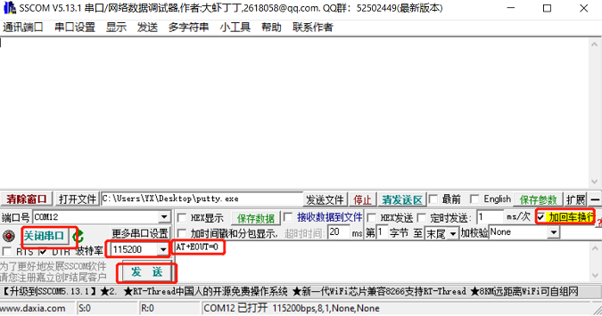

<div style="page-break-after: always; break-after: page;"></div>

### AT指令列表

| 指令      | 功能                   | 掉电保存(Y) /掉电不保存(N) | 立即生效(Y)/复位生效(N) | 备注         |
| --------- | ---------------------- | -------------------------- | ----------------------- | ------------ |
| AT+INFO   | 打印模块信息           | N                          | Y                       |              |
| AT+ODR    | 设置模块串口输出帧频率 | Y                          | N                       |              |
| AT+BAUD   | 设置串口波特率         | Y                          | N                       |              |
| AT+EOUT   | 数据输出开关           | N                          | Y                       |              |
| AT+RST    | 复位模块               | N                          | Y                       |              |
| AT+URFR   | 安装角度设置           | Y                          | N                       |              |
| AT+SETYAW | 手动设置航向角         | N                          | Y                       |              |
| AT+RSTORT | 安装对齐设置           | Y                          | Y                       |              |
| AT+SETPTL | 设置输出数据包         | Y                          | Y                       | 部分型号支持 |
| AT+MODE   | 设置模块工作模式       | Y                          | N                       | 部分型号支持 |

### 指令详解

#### AT+INFO(打印模块信息)

打印模块信息，包括产品型号，版本，固件发布日期等。


#### AT+ODR(设置帧输出速率)

设置模块串口输出速率。 掉电保存，复位模块生效
**例** 设置串口输出速率为100Hz:  `AT+ODR=100` 

>
> 当ODR设置为比较高时(如200),默认的115200波特率可能不满足输出带宽要求，此时需要将模块波特率设高(如921600)后，模块才能按设置的ODR输出数据帧。输出帧率可以为1,2,5,10,20,50,100,200,400Hz。

#### AT+BAUD(设置串口波特率)

设置串口波特率

**例**  `AT+BAUD=115200`

<div style="page-break-after: always; break-after: page;"></div>

> 使用此指令需要特别注意，输入错误波特率后会导致无法和模块通讯。
> 波特率参数设置好后掉电保存，复位模块生效。上位机的波特率也要做相应修改。
> 升级固件时，需要切换回115200 波特率。

#### AT+EOUT(开关串口输出)

串口输出开关

**例** 打开串口输出 `AT+EOUT=1`   关闭串口输出 `AT+EOUT=0`

#### AT+RST(复位模块)

复位模块

**例** `AT+RST`

#### AT+SETYAW(手动设置航向角)

设置航向角，格式为`AT+SETYAW=<MODE>,<VAL>`

* MODE=0 绝对模式：将航向角直接设置为VAL的值。 如 `AT+SETYAW=0,90`将航向角直接设置为90°
* MODE=1 相对模式：将原航向角递增VAL值。如`AT+SETYAW=1,-10.5` 将航向角递增-10.5°，如原来为30°，发送命令后航向角变为19.5°。

#### AT+MODE(6轴9轴模式切换)

设置模块工作模式

**例** 

* 设置模块工作在6轴模式(无磁校准)  `AT+MODE=0`
* 设置模块工作在9轴模式(地磁场传感器参与航向角校正)  `AT+MODE=1`

> 该指令仅支持CH010M、CH020M、CH040MP，不支持CH010、CH020、CH040

#### AT+URFR(设置安装坐标系)

这条指令提供了旋转传感器XYZ轴的接口，可用于任意角度的垂直安装。

`AT+URFR=C00,C01,C02,C10,C11,C12,C20,C21,C22` 

其中  $C_{nn}$  支持浮点数 

$$
\left\{\begin{array}{l}{X} \\ {Y} \\ {Z}\end{array}\right\}_{U}=\left[\begin{array}{lll}{C 00} & {C 01} & {C 02} \\ {C 10} & {C 11} & {C 12} \\ {C 20} & {C 21} & {C 22}\end{array}\right] \cdot\left\{\begin{array}{l}{X} \\ {Y} \\ {Z}\end{array}\right\}_{B}
$$

其中 $\left\{\begin{array}{l}{X} \\ {Y} \\ {Z}\end{array}\right\}_{U}$ 为旋转后的 传感器坐标系下 传感器数据，$\left\{\begin{array}{l}{X} \\ {Y} \\ {Z}\end{array}\right\}_{B}$为旋转前 传感器坐标系下 传感器数据


下面是几种常用旋转举例：

- 新传感器坐标系为 绕原坐标系X轴 旋转 -90°(适用于垂直安装:Y轴正方向朝下)， 输入命令：`AT+URFR=1,0,0,0,0,1,0,-1,0`
- 新传感器坐标系为 绕原坐标系X轴 旋转  90°(适用于垂直安装:Y轴正方向朝上)， 输入命令：`AT+URFR=1,0,0,0,0,-1,0,1,0`
- 新传感器坐标系为 绕原坐标系X轴 旋转180°， 输入命令：`AT+URFR=1,0,0,0,-1,0,0,0,-1`
- 新传感器坐标系为 绕原坐标系Y轴 旋转 90°(适用于垂直安装:X轴正方向朝上)， 输入命令：`AT+URFR=0,0,-1,0,1,0,1,0,0`
- 新传感器坐标系为 绕原坐标系Y轴 旋转-90°(适用于垂直安装:X轴正方向朝下)， 输入命令：`AT+URFR=0,0,1,0,1,0,-1,0,0`
- 新传感器坐标系为 绕原坐标系Y轴 旋转180°， 输入命令：`AT+URFR=-1,0,0,0,1,0,0,0,-1`
- 新传感器坐标系为 绕原坐标系Z轴 旋转90°， 输入命令：`AT+URFR=0,-1,0,1,0,0,0,0,1`
- 新传感器坐标系为 绕原坐标系Z轴 旋转-90°， 输入命令：`AT+URFR=0,1,0,-1,0,0,0,0,1`
- 恢复出厂默认值：`AT+URFR=1,0,0,0,1,0,0,0,1`

#### AT+RSTORT(水平安装调平)

一些情况下，模块安装时需要设置水平对齐(Pitch=Roll=0) 或者全部对齐(Pitch=Roll=Yaw=0)，这是需要给模块的一个初始姿态偏移。使用此命令可以完成对齐配置。

* `AT+RSTORT=0`: Object Reset: Pitch = Roll= Yaw = 0,  该设置立即生效且掉电保存。
* `AT+RSTORT=1`: Heading Reset: Pitch, Roll 保持不变, Yaw=0,  该设置立即生效且掉电保存。
* `AT+RSTORT=2`: Alignment Reset:  Pitch = Roll = 0, Yaw保持不变, 该设置立即生效且掉电保存。
* `AT+RSTORT=3`: Reset Offset: 清除所有对齐偏移设置,  该设置立即生效且掉电保存。


## CAN通讯协议

CAN通讯协议可支持 CANopen协议和SAE J1939协议。模块默认支持CANopen协议，如需J1939协议版本，请联系技术支持。

### CANopen协议

本产品CAN接口遵循以下标准：

* CAN接口符合CANopen协议，所有通讯均使用标准数据帧，只使用PTO1-4 传输数据。不接收/发送远程帧和拓展数据帧
* 所有PTO采用异步定时触发模式。


#### CANopen 默认设置

| CANopen默认配置 | 值                     |
| --------------- | ---------------------- |
| CAN 波特率      | 500KHz                 |
| CANopen节点ID   | 8                      |
| 初始化状态      | Operational            |
| 心跳包          | 无                     |
| TPDO输出速率    | 10Hz - 200Hz(每个TPDO) |


#### CANopen TPDO

| PTO通道 | PTO 帧ID | 长度（DLC） | PTO 传输方式   | 异步输出频率（Hz） | 发送数据 | 说明                                                         |
| ------- | -------- | ----------- | -------------- | ------------------ | -------- | ------------------------------------------------------------ |
| TPDO1   | 0x180+ID | 6           | 异步定时(0xFE) | 100                | 加速度   | 类型:int16,低字节在前，每个轴2字节，共6字节。分别为X,Y,Z轴加速度，单位为mG(0.001重力加速度) |
| TPDO2   | 0x280+ID | 6           | 异步定时(0xFE) | 100                | 角速度   | 类型:int16,低字节在前，每个轴2字节，共6字节。分别为X,Y,Z轴角速度，单位为0.1DPS(°/s) |
| TPDO3   | 0x380+ID | 6           | 异步定时(0xFE) | 100                | 欧拉角   | 类型:int16,低字节在前，每个轴2字节，共6字节。顺序分别为 横滚角:Roll, 俯仰角:Pitch, 航向角:Yaw。单位为0.01° |
| TPDO4   | 0x480+ID | 8           | 异步定时(0xFE) | 100                | 四元数   | 类型:int16,低字节在前,每个元素2字节，共8字节。分别为$$ q_{w} \ q_{x}\ q_{y}\ q_{z}$$ 。单位四元数扩大10000倍后结果。如四元数为1,0,0,0 时, 输出10000,0,0,0. |
| TPDO6   | 0x680+ID | 4           | 异步定时(0xFE) | 20                 | 气压     | 类型:int32 共4字节。单位Pa                                   |


例:

收到加速度CAN帧：`ID=0x188，DATA = 4A 00 1F 00 C8 03`

* ID=0x188: ID为8的设备发送的加速度数据帧
* 加速度X轴 = 0x004A = 74 =74mG
* 加速度Y轴 = 0x001F = 731 = 31mG
* 加速度Z轴 = 0x03C8 = 968 = 968mG

收到角速度CAN帧：`ID=0x288，DATA = 15 00 14 01 34 00`

* ID=0x288: ID为8的设备发送的角速度数据帧
* 角速度X轴 = 0x0015 = 21 = 2.1dps
* 角速度Y轴 = 0x0114 = 276 = 27.6dps
* 角速度Z轴 = 0x0034 = 52= 5.2dps

  ### 使用上位机连接CAN设备

使用PCAN-View工具，配合PCAN-USB，可以在接收框(Rx Message)中会显示收到的CAN消息及帧率，如下图所示:

<div align="center">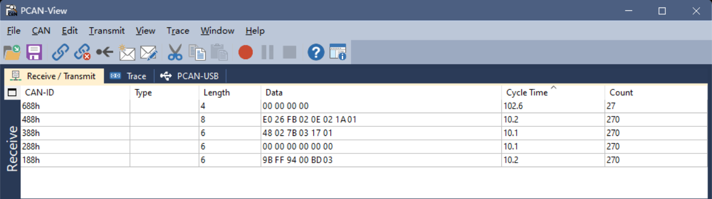

#### CANopen接口常用命令

##### 全局使能/关闭数据输出(开启异步触发)

使用CANopen NMT协议帧:

* 使能全局数据输出`ID=0x000，DATA=01 08`
* 关闭全局数据输出`ID=0x000，DATA=02 08`


数据字典以下位置存放厂商参数配置数据, 可通过CANopen 发送快速SDO指令修改，**掉电保存，重新上电生效**。

| 数据字典位置 | 子偏移 | 名称     | 值类型    | 默认值 | 说明                                        |
| ------------ | ------ | -------- | --------- | ------ | ------------------------------------------- |
| 0x2100       | 0      | CAN_BAUD | INTEGER32 | 500000 | CAN总线波特率                               |
| 0x2101       | 0      | NODE_ID  | INTEGER32 | 8      | CANOPEN 节点 ID                             |
| 0x2104       | 0      | CAN_TR   | INTEGER32 | 0      | 1:接通120ohm终端电阻， 0:断开120ohm终端电阻 |

以上配置操作均使用快速SDO来写数据字典, 其中TPDO通道与其对应的参数索引为：

| PTO通道 | PTO 帧ID | TPDO参数索引地址(CANopen协议默认定义) | 说明   |
| ------- | -------- | ------------------------------------- | ------ |
| TPDO1   | 0x180+ID | 0x1800                                | 加速度 |
| TPDO2   | 0x280+ID | 0x1801                                | 角速度 |
| TPDO3   | 0x380+ID | 0x1802                                | 欧拉角 |
| TPDO4   | 0x480+ID | 0x1803                                | 四元数 |
| TPDO6   | 0x680+ID | 0x1804                                | 气压   |

##### 修改CAN波特率

修改波特率:(ID=0x608, 长度为8的标准数据帧, 重新上电生效)

* CAN波特率修改为125K: `ID=0x608，DATA=23,00,21,00,48,E8,01,00`
* CAN波特率修改为250K: `ID=0x608，DATA=23,00,21,00,90,D0,03,00`
* CAN波特率修改为500K: `ID=0x608，DATA=23,00,21,00,20,A1,07,00`
* CAN波特率修改为1M:    `ID=0x608，DATA=23,00,21,00,40,42,0F,00`

解释：设置波特率为125KHz： ID=0x608为快速写SDO地址,其中8为默认节点ID，修改节点ID后要做相应修改,如CANopen ID改为9后,ID=0x609， 0x23为SDO写四个字节指令， 0x00, 0x21为写0x2100索引，0x00 子索引位置，默认0，(4-7字节)0x00, 0x01, 0xE8, 0x48 = (0x00<<24) + (0x01<<16) + (0xE8<<8) + 0x48 = 125000。

##### 修改节点ID

如将设备CANopen节点ID改为9, 重新上电生效

`ID=0x608，DATA=23,01,21,00,09,00,00,00`

解释：0x23为SDO写四个字节指令 ， 0x01, 0x21为写0x2101索引， 0x09 0x00, 0x00, 0x00 = (0x00<<24) + (0x00<<16) + (0x00<<8) + 0x09 = 9。

> ID修改范围：1-64， 生效后发送启动节点命令(比如节点启动命令数据变为01 09)和SDO指令(发送CAN帧ID变为0x609)时注意为新的地址

##### 切换CAN协议

* `ID=0x608，DATA=23,06,21,00,00,00,00,00`  切换协议为CANopen协议，重新后生效
* `ID=0x608，DATA=23,06,21,00,01,00,00,00`  切换协议为J1939协议，重新后生效

##### 修改/关闭/开启数据输出速率

此项配置立即生效, 掉电保存

* `ID=0x608，DATA=2B,00,18,05,00,00,00,00`关闭加速度输出
* `ID=0x608，DATA=2B,00,18,05,05,00,00,00`加速度200Hz输出
* `ID=0x608，DATA=2B,00,18,05,0A,00,00,00`加速度100Hz输出
* `ID=0x608，DATA=2B,00,18,05,14,00,00,00`加速度50Hz输出
* `ID=0x608，DATA=2B,00,18,05,32,00,00,00`加速度20Hz输出
* `ID=0x608，DATA=2B,00,18,05,64,00,00,00`加速度10Hz输出(最低10Hz)
* `ID=0x608，DATA=2B,01,18,05,00,00,00,00`关闭角速度输出
* `ID=0x608，DATA=2B,01,18,05,05,00,00,00`角速度200Hz输出
* `ID=0x608，DATA=2B,01,18,05,0A,00,00,00`角速度100Hz输出
* `ID=0x608，DATA=2B,01,18,05,14,00,00,00`角速度50Hz输出
* `ID=0x608，DATA=2B,01,18,05,32,00,00,00`角速度20Hz输出
* `ID=0x608，DATA=2B,01,18,05,64,00,00,00`角速度10Hz输出(最低10Hz)
* `ID=0x608，DATA=2B,02,18,05,00,00,00,00`关闭欧拉角输出
* `ID=0x608，DATA=2B,02,18,05,05,00,00,00`欧拉角200Hz输出
* `ID=0x608，DATA=2B,02,18,05,0A,00,00,00`欧拉角100Hz输出
* `ID=0x608，DATA=2B,02,18,05,14,00,00,00`欧拉角50Hz输出
* `ID=0x608，DATA=2B,02,18,05,32,00,00,00`欧拉角20Hz输出
* `ID=0x608，DATA=2B,02,18,05,64,00,00,00`欧拉角10Hz输出(最低10Hz)
* `ID=0x608，DATA=2B,03,18,05,00,00,00,00`关闭四元数输出
* `ID=0x608，DATA=2B,03,18,05,05,00,00,00`四元数200Hz输出
* `ID=0x608，DATA=2B,03,18,05,0A,00,00,00`四元数100Hz输出
* `ID=0x608，DATA=2B,03,18,05,14,00,00,00`四元数50Hz输出
* `ID=0x608，DATA=2B,03,18,05,32,00,00,00`四元数20Hz输出
* `ID=0x608，DATA=2B,03,18,05,64,00,00,00`四元数10Hz输出(最低10Hz)
* `ID=0x608，DATA=2B,04,18,05,00,00,00,00`关闭气压输出
* `ID=0x608，DATA=2B,04,18,05,05,00,00,00`气压200Hz输出
* `ID=0x608，DATA=2B,04,18,05,0A,00,00,00`气压100Hz输出
* `ID=0x608，DATA=2B,04,18,05,14,00,00,00`气压50Hz输出
* `ID=0x608，DATA=2B,04,18,05,32,00,00,00`气压20Hz输出
* `ID=0x608，DATA=2B,04,18,05,64,00,00,00`气压10Hz输出(最低10Hz)

解释：以 TPDO0(加速度)输出速率为100Hz(每10ms输出一次)为例：0x2B为SDO写两个字节指令。 0x00, 0x18为写0x1800索引。0x05为子索引。0x00, 0x0A= (0x00<<8) + 0x0A = 10(单位为ms)，后面不足补0.

##### 配置TPDO为同步模式
先关闭所有TPDO(设置TPDO输出速率为0)， 然后发送CANopen同步帧即可：

CANopen 同步帧: `ID:80，DATA:空` 

## RS485通讯协议(Modbus)

RS485通讯协议遵循Modbus RTU协议规范，数据以寄存器为单位进行发送和接收，每个寄存器占用2个字节，采用大端模式(高字节在前)，模块支持的默认配置与指令如下：

* 支持Modbus 指令： 

  * 写入: 0x06 (Write Single Register) :写单个寄存器(每个Modbus寄存器为2个字节)
  * 读取: 0x03 (Read Holding Registers): 读取单个或多个寄存器数据
  * 自定义功能码: 0x50,  用于 Modbus ID自动分配，方便量产部署，固件升级等
* Modbus设备地址可修改, 出厂默认: 80 (0x50)
* 支持波特率: 4800-921600, 出厂默认:115200, 格式: 8位数据位，1位停止位，无校验位(N8N1)

### 数据帧格式

#### 读寄存器(0x03)

主机发送:

| 域名称   | 值     | 说明                                      |
| -------- | ------ | ----------------------------------------- |
| ID       | 1-0xFF | Modbus设备地址                            |
| FUN_CODE | 0x03   | 命令码                                    |
| ADDR_H   | -      | 要读取的寄存器地址高8位                   |
| ADDR_L   | -      | 要读取的寄存器地址低8位                   |
| LEN_H    | -      | 要读取寄存器长度高8位(以寄存器个数为单位) |
| LEN_L    | -      | 要读取寄存器长度低8位(以寄存器个数为单位) |
| CRC_L    | -      | CRC低8位                                  |
| CRC_H    | -      | CRC高8位                                  |

从机(模块)返回:
| 域名称   | 值     | 说明                                                         |
| -------- | ------ | ------------------------------------------------------------ |
| ID       | 1-0xFF | Modbus设备地址                                               |
| FUN_CODE | 0x03   | 命令码                                                       |
| LEN      | -      | 返回寄存器数据的长度(不算ID，FUN_CODE,LEN,CRC字段)以字节为单位 |
| DATAH    | -      | 返回数据高8位                                                |
| DATAL    | -      | 返回数据低8位                                                |
| ----     | -      | 返回数据高8位                                                |
| ----     | -      | 返回数据低8位                                                |
| CRC_L    | -      | CRC低8位                                                     |
| CRC_H    | -      | CRC高8位                                                     |


#### 写寄存器(0x06)

| 域名称   | 值     | 说明                    |
| -------- | ------ | ----------------------- |
| ID       | 1-0xFF | Modbus设备地址          |
| FUN_CODE | 0x06   | 命令码                  |
| ADDR_H   | -      | 要读取的寄存器地址高8位 |
| ADDR_L   | -      | 要读取的寄存器地址低8位 |
| DATA_H   | -      | 写入数据高8位           |
| DATA_L   | -      | 写入数据低8位           |
| CRC_L    | -      | CRC低8位                |
| CRC_H    | -      | CRC高8位                |

从机返回:
| 域名称   | 值     | 说明                    |
| -------- | ------ | ----------------------- |
| ID       | 1-0xFF | Modbus设备地址          |
| FUN_CODE | 0x06   | 命令码                  |
| ADDR_H   | -      | 要读取的寄存器地址高8位 |
| ADDR_L   | -      | 要读取的寄存器地址低8位 |
| DATA_H   | -      | 写入数据高8位           |
| DATA_L   | -      | 写入数据低8位           |
| CRC_L    | -      | CRC低8位                |
| CRC_H    | -      | CRC高8位                |

#### CRC校验

* 在线计算CRC：https://www.23bei.com/tool/59.html

* C代码：

  ```
  static const uint16_t modbus_crc_table[256] = {
     0x0000, 0xc0c1, 0xc181, 0x0140, 0xc301, 0x03c0, 0x0280, 0xc241,
     0xc601, 0x06c0, 0x0780, 0xc741, 0x0500, 0xc5c1, 0xc481, 0x0440,
     0xcc01, 0x0cc0, 0x0d80, 0xcd41, 0x0f00, 0xcfc1, 0xce81, 0x0e40,
     0x0a00, 0xcac1, 0xcb81, 0x0b40, 0xc901, 0x09c0, 0x0880, 0xc841,
     0xd801, 0x18c0, 0x1980, 0xd941, 0x1b00, 0xdbc1, 0xda81, 0x1a40,
     0x1e00, 0xdec1, 0xdf81, 0x1f40, 0xdd01, 0x1dc0, 0x1c80, 0xdc41,
     0x1400, 0xd4c1, 0xd581, 0x1540, 0xd701, 0x17c0, 0x1680, 0xd641,
     0xd201, 0x12c0, 0x1380, 0xd341, 0x1100, 0xd1c1, 0xd081, 0x1040,
     0xf001, 0x30c0, 0x3180, 0xf141, 0x3300, 0xf3c1, 0xf281, 0x3240,
     0x3600, 0xf6c1, 0xf781, 0x3740, 0xf501, 0x35c0, 0x3480, 0xf441,
     0x3c00, 0xfcc1, 0xfd81, 0x3d40, 0xff01, 0x3fc0, 0x3e80, 0xfe41,
     0xfa01, 0x3ac0, 0x3b80, 0xfb41, 0x3900, 0xf9c1, 0xf881, 0x3840,
     0x2800, 0xe8c1, 0xe981, 0x2940, 0xeb01, 0x2bc0, 0x2a80, 0xea41,
     0xee01, 0x2ec0, 0x2f80, 0xef41, 0x2d00, 0xedc1, 0xec81, 0x2c40,
     0xe401, 0x24c0, 0x2580, 0xe541, 0x2700, 0xe7c1, 0xe681, 0x2640,
     0x2200, 0xe2c1, 0xe381, 0x2340, 0xe101, 0x21c0, 0x2080, 0xe041,
     0xa001, 0x60c0, 0x6180, 0xa141, 0x6300, 0xa3c1, 0xa281, 0x6240,
     0x6600, 0xa6c1, 0xa781, 0x6740, 0xa501, 0x65c0, 0x6480, 0xa441,
     0x6c00, 0xacc1, 0xad81, 0x6d40, 0xaf01, 0x6fc0, 0x6e80, 0xae41,
     0xaa01, 0x6ac0, 0x6b80, 0xab41, 0x6900, 0xa9c1, 0xa881, 0x6840,
     0x7800, 0xb8c1, 0xb981, 0x7940, 0xbb01, 0x7bc0, 0x7a80, 0xba41,
     0xbe01, 0x7ec0, 0x7f80, 0xbf41, 0x7d00, 0xbdc1, 0xbc81, 0x7c40,
     0xb401, 0x74c0, 0x7580, 0xb541, 0x7700, 0xb7c1, 0xb681, 0x7640,
     0x7200, 0xb2c1, 0xb381, 0x7340, 0xb101, 0x71c0, 0x7080, 0xb041,
     0x5000, 0x90c1, 0x9181, 0x5140, 0x9301, 0x53c0, 0x5280, 0x9241,
     0x9601, 0x56c0, 0x5780, 0x9741, 0x5500, 0x95c1, 0x9481, 0x5440,
     0x9c01, 0x5cc0, 0x5d80, 0x9d41, 0x5f00, 0x9fc1, 0x9e81, 0x5e40,
     0x5a00, 0x9ac1, 0x9b81, 0x5b40, 0x9901, 0x59c0, 0x5880, 0x9841,
     0x8801, 0x48c0, 0x4980, 0x8941, 0x4b00, 0x8bc1, 0x8a81, 0x4a40,
     0x4e00, 0x8ec1, 0x8f81, 0x4f40, 0x8d01, 0x4dc0, 0x4c80, 0x8c41,
     0x4400, 0x84c1, 0x8581, 0x4540, 0x8701, 0x47c0, 0x4680, 0x8641,
     0x8201, 0x42c0, 0x4380, 0x8341, 0x4100, 0x81c1, 0x8081, 0x4040
  };
   
   uint16_t modbus_crc_calc(uint8_t *buf, uint16_t len)
  {
      uint16_t crc = 0xFFFFU; 
      uint8_t nTemp;
   
      while (len--)
      {
          nTemp = *buf++ ^ crc;
          crc >>= 8;
          crc  ^= modbus_crc_table[(nTemp & 0xFFU)];
      }
   
      return(crc);
  }
  ```

### 寄存器列表

| 地址(16进制) | 地址(十进制) | 名称       | 功能                 | 读写属性(R/W) | 说明                                                         |
| ------------ | ------------ | ---------- | -------------------- | ------------- | ------------------------------------------------------------ |
| 0x00         | 0            | CTL        | 控制                 | W             | 参见Modbus 设置模块章节                                      |
| 0x04         | 4            | BAUD       | 波特率               | R             | 波特率                                                       |
| 0x05         | 5            | ID         | ID                   | R             | Modbus ID                                                    |
| 0x1F         | 31           | BW         | 带宽                 | R/W           | 截止频率: 0:12Hz, 1:23Hz 2:32Hz 3:47Hz(默认) 4:64Hz, 5:116Hz |
|              |              |            |                      |               |                                                              |
| 0x34         | 52           | ACCX       | 加速度X              | R             | 单位G(1G=1重力加速度), 比例因子:0.00048828                   |
| 0x35         | 53           | ACCY       | 加速度Y              | R             | 单位G(1G=1重力加速度), 比例因子:0.00048828                   |
| 0x36         | 54           | ACCZ       | 加速度Z              | R             | 单位G(1G=1重力加速度), 比例因子:0.00048828                   |
| 0x37         | 55           | GYRX       | 角速度X              | R             | 单位deg/s, 比例因子:0.061035                                 |
| 0x38         | 56           | GYRY       | 角速度Y              | R             | 单位deg/s, 比例因子:0.061035                                 |
| 0x39         | 57           | GYRZ       | 角速度Z              | R             | 单位deg/s, 比例因子:0.061035                                 |
| 0x3A         | 58           | MAGX       | 磁强度X              | R             | 单位uT, 比例因子: 0.030517                                   |
| 0x3B         | 59           | MAGY       | 磁强度Y              | R             | 单位uT, 比例因子: 0.030517                                   |
| 0x3C         | 60           | MAGZ       | 磁强度Z              | R             | 单位uT, 比例因子: 0.030517                                   |
| 0x3D         | 61           | ROLL_H     | 横滚角高16位         | R             | 单位deg, 比例因子:0.001                                      |
| 0x3E         | 62           | ROLL_L     | 横滚角低16位         | R             | 单位deg, 比例因子:0.001                                      |
| 0x3F         | 63           | PITCH_H    | 俯仰角高16位         | R             | 单位deg, 比例因子:0.001                                      |
| 0x40         | 64           | PITCH_L    | 俯仰角低16位         | R             | 单位deg, 比例因子:0.001                                      |
| 0x41         | 65           | YAW_H      | 航向角高16位         | R             | 单位deg, 比例因子:0.001                                      |
| 0x42         | 66           | YAW_L      | 航向角低16位         | R             | 单位deg, 比例因子:0.001                                      |
| 0x43         | 67           | TEMP       | 温度                 | R             | 单位℃, 比例因子:0.01                                         |
| 0x44         | 68           | PRS_H      | 气压高16位           | R             | 单位Pa, 比例因子:0.01                                        |
| 0x45         | 69           | PRS_L      | 气压低16位           | R             | 单位Pa, 比例因子:0.01                                        |
| 0x46         | 70           | Q0         | 四元数QW             | R             | 四元数，比例因子: 0.00003                                    |
| 0x47         | 71           | Q1         | 四元数QX             | R             | 四元数，比例因子: 0.00003                                    |
| 0x48         | 72           | Q2         | 四元数QY             | R             | 四元数，比例因子: 0.00003                                    |
| 0x49         | 73           | Q3         | 四元数QZ             | R             | 四元数，比例因子: 0.00003                                    |
| 0x4A         | 74           | SINGLE_X   | X 轴单轴角度         | R             | 单轴倾角仪X角度，0-360,单位deg,比例因子: 0.00549             |
| 0x4B         | 74           | SINGLE_Y   | Y 轴单轴角度         | R             | 单轴倾角仪Y角度，0-360,单位deg,比例因子: 0.00549             |
|              |              |            |                      |               |                                                              |
| 0x66         | 102          | KF_ACC_R   | 加速度计姿态反馈系数 | R/W           | 加速度姿态修正系数调节，默认:10, 范围:1-20, 值越小加速度修正力度越大. |
|              |              |            |                      |               |                                                              |
| 0x70-0x77    | 112-119      | PNAME      | 设备名               | R             | 设备名字符串, ASCII码，共占8个寄存器                         |
| 0x78         | 120          | SW_VERSION | 软件版本             | R             | 软件版本                                                     |
| 0x79         | 121          | BL_VERSION | BL版本               | R             | BL版本                                                       |
| 0x7F-0x82    | 127-130      | SN         | 产品唯一序列号       | R             | 产品唯一序列号, 占4寄存器                                    |
|              |              |            |                      |               |                                                              |
| 0xA0-0xAF    | 160-175      | ACC_CAL    | 加速度计校准参数     | R             | 加速度计出厂校准参数，比例因子:0.001                         |
| 0xB0-0xBF    | 176-191      | GYR_CAL    | 陀螺校准参数         | R             | 陀螺出厂校准参数，比例因子:0.001                             |
| 0xC0-0xCF    | 192-207      | MAG_CAL    | 磁强计校准参数       | R             | 磁传感器出厂校准参数，比例因子:0.001                         |
|              |              |            |                      |               |                                                              |


### 配置模块

> 以下所有配置示例默认Modbus地址为0x50(出厂默认), 如果Modbus ID已经被用户修改，则ID字段和CRC字段需要更改。

| 命令                                                         | CTL寄存器写入值 | 命令Hex串(默认ID为0x50)                                    |
| ------------------------------------------------------------ | --------------- | ---------------------------------------------------------- |
| 保存所有配置参数到Flash                                      | 0x0000          | 50 06 00 00 00 00 84 4B                                    |
| 恢复出厂设置                                                 | 0x0001          | 50 06 00 00 00 01 45 8B                                    |
| 设置工作模式为6轴模式                                        | 0x0003          | 50 06 00 00 00 03 C4 4A                                    |
| 设置工作模式为9轴模式                                        | 0x0004          | 50 06 00 00 00 04 85 88                                    |
| 设置工作模式为纯陀螺积分模式                                 | 0x0005          | 50 06 00 00 00 05 44 48                                    |
| 初始姿态偏移设置(调平)<br/>Pitch = Roll= Yaw = 0 立即生效且掉电保存 | 0x0010          | 50 06 00 00 00 10 85 87                                    |
| 初始姿态设置(调平)<br/>Pitch = Roll = 0, Yaw保持不变,  立即生效且掉电保存 | 0x0011          | 50 06 00 00 00 11 44 47                                    |
| 初始姿态设置(调平)<br/>Pitch, Roll 保持不变, Yaw=0, 立即生效且掉电保存 | 0x0012          | 50 06 00 00 00 12 04 46                                    |
| 初始姿态设置(调平)<br/>清除所有初始姿态设置,  立即生效且掉电保存 | 0x0013          | 50 06 00 00 00 13 C5 86                                    |
| 安装方向设置: 设置为水平安装(正常模式)                       | 0x0020          | 50 06 00 00 00 20 85 93                                    |
| 安装方向设置: 垂直安装:Y轴正方向朝下                         | 0x0021          | 50 06 00 00 00 21 44 53                                    |
| 安装方向设置: 垂直安装:Y轴正方向朝上                         | 0x0022          | 50 06 00 00 00 22 04 52                                    |
| 安装方向设置: 垂直安装:X轴正方向朝上                         | 0x0023          | 50 06 00 00 00 23 C5 92                                    |
| 安装方向设置: 垂直安装:X轴正方向朝下                         | 0x0024          | 50 06 00 00 00 24 84 50                                    |
| 复位                                                         | 0x00FF          | 50 06 00 00 00 FF C4 0B                                    |
| 配置波特率为4800(复位生效)                                   | 0x0100          | 50 06 00 00 01 00 85 DB                                    |
| 配置波特率为9600(复位生效)                                   | 0x0101          | 50 06 00 00 01 01 44 1B                                    |
| 配置波特率为19200(复位生效)                                  | 0x0102          | 50 06 00 00 01 02 04 1A                                    |
| 配置波特率为38400(复位生效)                                  | 0x0103          | 50 06 00 00 01 03 C5 DA                                    |
| 配置波特率为57600(复位生效)                                  | 0x0104          | 50 06 00 00 01 04 84 18                                    |
| 配置波特率为115200(复位生效)                                 | 0x0105          | 50 06 00 00 01 05 45 D8                                    |
| 配置波特率为230400(复位生效)                                 | 0x0106          | 50 06 00 00 01 06 05 D9                                    |
| 配置波特率为460800(复位生效)                                 | 0x0107          | 50 06 00 00 01 07 C4 19                                    |
| 配置波特率为921600(复位生效)                                 | 0x0108          | 50 06 00 00 01 08 84 1D                                    |
| 配置Modbus ID(复位生效)                                      | 0x0200 +ID      | 如需要配置 Modbus ID为 0x03,则发送 50 06 00 00 02 03 C5 2A |

### 读取数据示例

#### 读取模块产品名, 软件版本及SN号

**TX**(主机发送): `50 03 00 70 00 13 08 5D ` 

解释: ID=0x50, CMD=0x03, 读取起始地址0x70, 读取长度:0x13, CRC: 0x085D 

**RX**(从机响应): `50 03 26 00 43 00 48 00 31 00 30 00 58 00 28 00 4D 00 29 00 73 00 00 00 00 00 00 00 00 00 00 00 00 06 DD C2 9C 6D 06 97 0F 7F 5F `

解释：`50 03 26`: 从机地址0x50,  命令码:0x03, 数据部分共0x26= 38字节, `00 43 00 48 00 31 00 30 00 58 00 28 00 4D 00 29 00 73 00 00 00 00 00 00 00 00 00 00 00 00 06 DD C2 9C 6D 06 97 0F`,数据段: 产品名: CH10x(M), 软件版本:0x73(115), SN:06DDC29C6D06970F, `7F 5F`: CRC校验

#### 读取IMU姿态数据

**TX**(主机发送): `50 03 00 34 00 18 09 8F`

解释: ID=0x50, CMD=0x03, 读取起始地址0x34, 读取长度:0x18, CRC: 0x098F

**RX**(从机响应): `50 03 30 FF 01 03 B0 06 50 FC C9 FF 7C 00 91 01 D5 FD DB FD 27 00 00 21 FF 00 00 7F F6 FF FD 73 E7 00 00 00 00 00 00 10 A6 0D 59 DD 4E 86 A8 06 30 17 82 1E CE`

解释: 
* 加速度: X=-255, Y=944, Z=1616 ->乘比例因子后结果: X= -0.1245, Y=0.4609, Z=0.7891G (1G=1重力加速度，可取9.8m/s^(2))
* 角速度: X=-823, Y=-132, Z=145 -> 乘比例因子后结果: X=-50.2318, Y=-8.0566, Z=8.8501deg/s
* 磁场: X=469, Y=-549, Z=-729 -> 乘比例因子后结果:  X=14.3125, Y=-16.7538, Z=-22.2469uT 
* 欧拉角: 横滚(Roll) =8703, 俯仰角(Pitch)=32758, 航向角(Yaw) =-166937  -> 乘比例因子后结果: Roll= 8.703deg, Pitch=32.758deg, Yaw=-166.937deg

### Modbus ID自动分配及固件升级

ID地址自动分配机制用于量产部署时多个模块挂接在同一个485总线的情况，模块可配合上位机完成ID自动地址分配，该功能只开放给量产客户，具体资料请联系我司获取。Modbus固件升级协议只开放给批量量产客户，具体资料请联系我司获取。

0x50 自定义指令格式为:  [ADDR] 0x50 [SUB_CMD] [DATA_LEN] [DATA]

目前支持的自定义指令列表:

1. 通过唯一SN号设定ID地址(0x0031): 格式: `00 50 00 31 00 0A [SN] [NEW_ADDR] CRC` 其中
   * SN: 设备唯一序列号：8字节
   * 需要设定的新ID地址: 1-255, 2字节
2. ID地址随机化生成(0x0030): 该指令会强制总线上的所有模块抛弃原来ID且生成新的介于MIN_ADDR和MAX_ADDR之间的新ID 格式: `00 50 00 30 00 06 [MIN] [MAX] FF FF CRC`
   * MIN: 生成随机ID的最小值, 2字节。
   * MAX: 生成随机ID的最大值 2字节。


## 参考设计

### 电源供电

​		CH0X0系列内置LDO，因此CH0X0的供电系统既可以选择LDO，也可以选择DC-DC

<div align="center">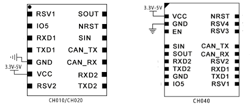

### CH010/CH020串口通信参考设计

### CH040串口通信参考设计

<div align="center">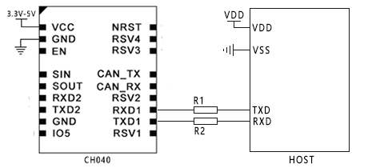

> 如果用户需要使用同步和复位功能，也可以将模块同步输出（SOUT）、同步输入（SIN）、NRST与主机相连，NRST内部已经内置阻容复位电路


### CH010/CH020基于TJA1044GT/3参考设计

<div align="center">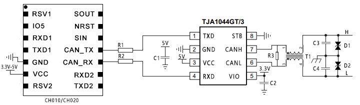

### CH040基于TJA1044GT/3参考设计

<div align="center">

> 终端电阻R3可根据实际情况选择是否需要焊接

| Item     | Reference | Part                           | P/N                 | Vendor   | Note     |
| -------- | --------- | ------------------------------ | ------------------- | -------- | -------- |
| 电阻     | R1,R2     | 1K                             | RC0402JR-071KL      | YAGEO    |          |
| 电阻     | R3        | 120Ω                           | RC1206FR-07120RL    | YAGEO    | optional |
| 电容     | C1,C2     | 0.1uF                          | CC0402KRX5R7BB104   | YAGEO    |          |
| 电容     | C3,C4     | 100pF                          | CC0402JRNPO9BN101   | YAGEO    |          |
| 共模电感 | T1        | 5.8kΩ@10MHz 100uH@100kHz 150mA | ACT45B-101-2P-TL003 | TDK      |          |
| TVS      | D1,D2     | SMBJ6.5CA                      | SMBJ6.5CA           | GOODWORK |          |

## 焊接

传感器 满足上IPC/JEDEC 标准的无铅焊接要求，即回流焊，峰值温度高达260°C。

> 传感器禁止手工维修和焊接，会影响精度

### 推荐的焊接条件

<div align="center">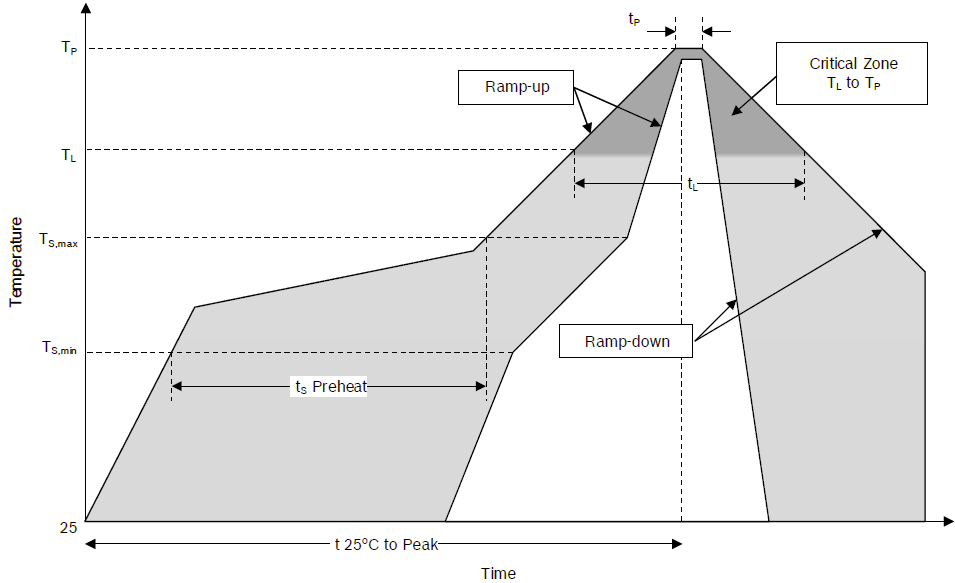

| 参数类型                                           | 无铅       |
| -------------------------------------------------- | ---------- |
| Average ramp-up rate (T~Smax~ to T~p~)             | 3℃/s max   |
| Temperature min (T~Smin~)                          | 150℃       |
| Temperature max (T~Smax~)                          | 200℃       |
| Time (T~Smin~ to T~Smax~)                          | 60-180s    |
| Temperature (T~L~)                                 | 170℃       |
| Time (t~L~)                                        | 60-150s    |
| Peak classification temperature (T~P~)             | 260℃       |
| Time within 5 °C of actual peak temperature (t~p~) | 20-40s     |
| Ramp-down rate                                     | 6℃/min max |
| Time 25°C to peak temperature                      | 8 min max  |

<div STYLE="page-break-after: always;"></div>

### 注意事项

​		通常来说MEMS传感器是由电子和机械结构组成的高精度测量设备，为实现精度、效率和机械坚固性而设计，需要将传感器安装在印刷电路板（PCB）上时，应考虑以下建议。

- 通常建议将PCB厚度最小化，因为薄PCB的固有应力较小，例如在弯曲过程中。（建议≤ 1.2 毫米）
- 不建议将传感器直接放在按钮触点的下方或旁边，因为这会导致机械应力。
- 不建议将传感器直接放置在温度极高的热点附近（例如控制器或图形芯片），因为这会导致PCB升温，从而导致传感器发热。
- 不建议将传感器放置在机械应力最大值附近（例如在对角交叉的中心）。机械应力会导致PCB和传感器弯曲。
- 不建议将传感器安装距离螺丝孔太近
- 避免将传感器安装在PCB可能或预期会出现谐振（振动）的区域。

​		如果上述建议无法得到适当实现，则在将器件放置在PCB上后进行特定的在线偏移校准可能有助于最大限度地减少潜在的影响。

## 固件升级与恢复出厂设置

本产品支持升级固件。
固件升级步骤:

- 连接模块，打开上位机，将模块和上位机波特率都设置为115200. 打开固件升级窗口
- 点击连接按钮，如出现模块连接信息。则说明升级系统准备就绪，点击文件选择器(…)选择拓
  展名为.hex 的固件，然后点击开始编程。下载完成后会提示编程完成，此时关闭串口，
  重新给模块上电，模块升级完成。

<div align="center">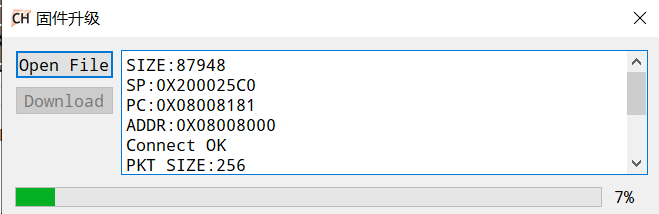

## 包装

​		CH0X0系列模组采⽤载带卷盘包装，然后装⼊铝箔袋 (MBB) 中抽真空以保护模组在运输和存储环境中受潮，最后放入披萨盒中。

### CH010/CH020载带规格

载带尺寸规格如下：

<div align="center">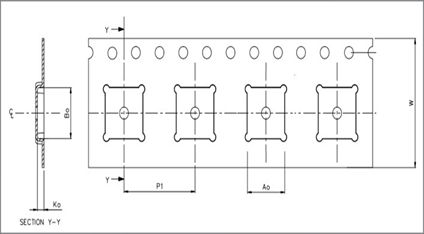

​																		      					

| 载带规格（单位：mm） |                |                |                |                |
| :------------------: | :------------: | :------------: | :------------: | :------------: |
|    载带宽度  (W)     | 气泡间距（P1） | 气泡宽度（A0） | 气泡长度（B0） | 气泡深度（K0） |
|      32 ± 0.20       |   20  ± 0.10   |    16.5±0.1    |     20±0.1     |    3.5±0.1     |

### CH010/CH020卷盘规格

卷盘尺寸如下：

<div align="center">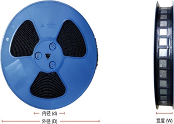	

<div STYLE="page-break-after: always;"></div>

| 卷盘规格      |              |              |         |
| ------------- | ------------ | ------------ | ------- |
| 卷盘外径  (D) | 卷盘内径 (d) | 卷盘宽度 (W) | 数量    |
| 330 mm        | 100 mm       | 35mm         | 1000pcs |

### CH010/CH020铝箔袋和披萨盒规格

铝箔袋和披萨盒规格如下：

<div align="center">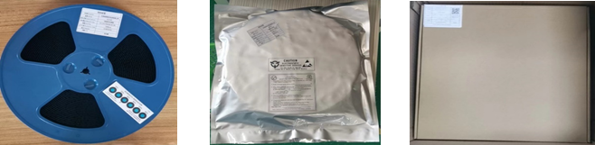	

| 规格尺寸（单位：mm） |                                     |
| -------------------- | ----------------------------------- |
| 铝箔袋尺寸           | 500*400                             |
| 披萨盒尺寸           | 360X360X46                          |
| 披萨盒包装内容       |                                     |
| 主要包材             | 规格说明                            |
| 湿敏敏指示卡         | 102 × 36 ，无钴，遇湿从蓝色变成红色 |
| 干燥剂               | 5g                                  |
| 物料料标签           | 80*60                               |

### 物料标签

| 信息      | 描述               |
| --------- | ------------------ |
| 供应商    | 模组的生产厂家     |
| 订单号码  | 订单编号           |
| 型号      | 模块的型号         |
| 品名/规格 | 模块的名称         |
| 数量      | 卷盘包装的模块数量 |
| 生产日期  | 出厂日期           |
| 盒数      | 盒数               |
| 品管      | 品质负责人确认     |

## 技术支持

新产品信息及技术支持，请关注超核电子公众号和官方网站

<div align="center">


